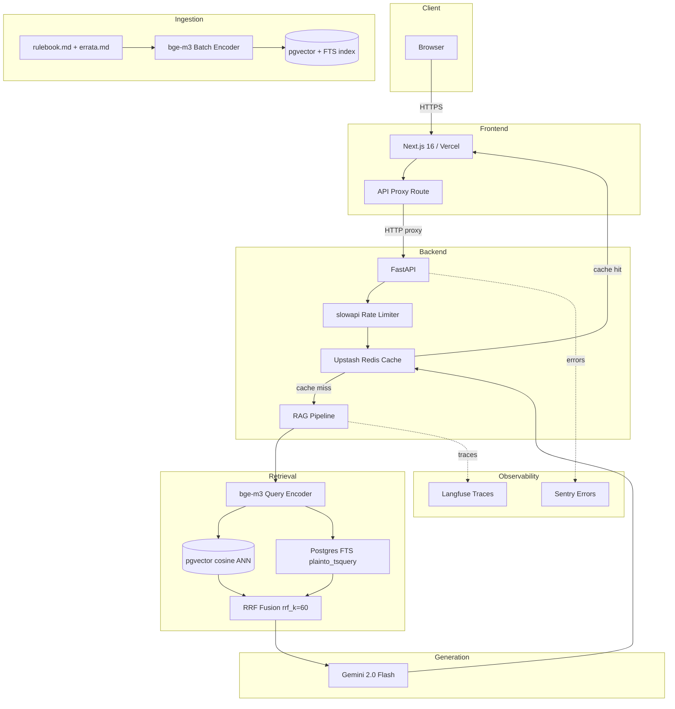

# Riftbound Judge AI

An AI-powered rules judge for Riftbound TCG. Ask rules questions in plain language and get grounded answers with citations from the official rulebook.


---

## What It Does

Riftbound Judge AI answers rules questions about the Riftbound trading card game by retrieving relevant passages from the official rulebook and using Gemini 2.0 Flash to generate a grounded, cited answer. The system refuses to speculate — if the retrieved context does not contain the answer, it defers rather than fabricates.

The project is built eval-first. Every architectural decision — embedding model, vector database, retrieval strategy — is tied to a measurable outcome. The evaluation set is 40 hand-curated question-answer pairs, each labelled by `difficulty`, `source`, and `tags`. Quality is measured by an LLM-as-judge harness (`correct`/`partial`/`wrong` verdict) plus a deterministic retrieval-recall check. A baseline run has been recorded — see [Results](#results).

---

## Live Demo

Just want to try it? Use the live app — no install required.

- **App (live)**: <!-- TODO: pegar la URL pública de Vercel, p. ej. https://judge-xxx.vercel.app -->
- **Backend API (Hugging Face Space)**: https://huggingface.co/spaces/GonzaViss/Judge
- **Slides**: <!-- TODO: URL pública de la presentación (Google Slides / Canva / PPT) -->
- **Video walkthrough**: <!-- TODO: URL pública del vídeo (YouTube / Drive) -->

> **Login**: this app has **no user login** — it is a public Q&A tool, so there are no test
> credentials to provide. (The only authentication is an internal proxy-shared-secret between
> the Next.js proxy and the FastAPI backend, not a user account.)

---

## Features

- **Natural-language rules Q&A** grounded in the official rulebook + errata, with inline citations.
- **Refuses to speculate** — defers when the retrieved context lacks the answer, instead of fabricating a ruling.
- **Hybrid retrieval** — dense pgvector cosine ANN + Postgres full-text search, fused with Reciprocal Rank Fusion (RRF), plus a HyDE (hypothetical-document embedding) arm.
- **Card `@mention` autocomplete** with automatic card-name and keyword detection (`backend/app/rag/card_detect.py`, `rules.py`).
- **Per-answer confidence score** and citation cards rendered in the UI.
- **In-app rulebook browser** at `/rules`.
- **Response caching** (Upstash Redis, optional) and **per-IP rate limiting** (slowapi: 10 req/min, 100 req/day).
- **Observability** — Langfuse traces and Sentry error reporting (both optional / env-gated).
- **Eval-first** — 40-question hand-curated eval set with an LLM-as-judge harness plus deterministic retrieval recall.

---

## Architecture



See [docs/architecture.md](docs/architecture.md) for a standalone version with narrative explanation.

---

## Tech Stack

| Technology | Role | Why |
|---|---|---|
| Python / FastAPI | API server | Async, Pydantic validation built-in |
| BAAI/bge-m3 | Embedding model | Free, local, multilingual-ready |
| Supabase / pgvector | Vector + FTS storage | Single DB for vectors, metadata, and full-text search |
| Gemini 2.0 Flash | LLM generation | Free tier (1M tok/day), fast, strong instruction following |
| Upstash Redis | Response cache | Serverless Redis — optional, disabled if env vars absent |
| Langfuse | LLM tracing | Per-request traces covering retrieval and generation |
| Sentry | Error reporting | Optional — disabled if DSN not set |
| Next.js 16 | Frontend | App Router, React 19, Vercel deployment |
| slowapi | Rate limiting | Per-IP limits: 10 req/min, 100 req/day |
| LLM-as-judge (Gemini) | Eval framework | `correct`/`partial`/`wrong` verdict + deterministic retrieval recall |

---

## Results

> **Eval status**: a baseline run has been recorded against the production (hybrid) pipeline using the LLM-as-judge harness. Verdicts are non-deterministic (the judge is an LLM); retrieval recall is deterministic. The vector-only baseline (Config A) is not yet wired — the harness runs the production hybrid config only. The eval set has grown to 40 questions; the latest run below uses a stratified 20-question subset (fixed seed) to stay under daily LLM quota rather than the full set.

| Config | Correct | Correct + Partial | Retrieval recall | Avg latency | Avg confidence |
|---|---|---|---|---|---|
| Hybrid, stratified 20-subset (seed=42) | 45% | 50% | 62% (5/8 evaluable) | 7536 ms | 0.910 |
| Hybrid (dense + FTS + RRF, production, full 20-question run) | 30% | 30% | 36% (5/14 evaluable) | 7177 ms | 0.639 |
| Vector-only (baseline A) | pending | pending | pending | pending | pending |

By difficulty (stratified 20-subset): easy 100% (2/2), medium 57% (4/7), hard 27% (3/11).

**Methodology**: Eval set of 40 hand-curated questions. Evaluation: an LLM-as-judge returns a `correct`/`partial`/`wrong` verdict per answer; retrieval recall is computed deterministically by matching the expected `rule_reference` against the returned citations (by rule-code lineage over each chunk's full content). Latency and confidence are measured server-side, excluding network. Run it yourself: `cd backend && python -m scripts.eval --limit 20 --seed 42` (or omit `--limit` for the full set).

> **Reading the numbers**: the `hard` bucket remains the ceiling (27%) — this is a known, accepted limitation (multi-step rulings require structured reasoning the system doesn't build), not a regression. Retrieval recall is still the main lever for the rest: when the right rule isn't retrieved, the answer is wrong. (An earlier run reported 14% recall; that was a measurement artifact in the matcher — see the eval-recall-metric fix — not a real retrieval result.)

---

## Key Decisions

The architecture reflects explicit tradeoffs documented as Architecture Decision Records. ADRs are the single source of truth for why things are the way they are — this section links to them rather than restating their content.

The most consequential decisions: choosing a local embedding model over a hosted API to eliminate per-query cost; keeping everything in a single Postgres instance to avoid dual-service complexity; switching from vector-only to hybrid retrieval after observing exact-token query failures in manual testing; and deferring entity resolution — there was no eval data to justify the complexity at v1.

- [ADR-001 — Embedding model: bge-m3 over OpenAI text-embedding-3-small](docs/adrs/ADR-001-embeddings.md)
- [ADR-002 — Vector database: pgvector on Supabase over dedicated vector DB](docs/adrs/ADR-002-vector-db.md)
- [ADR-003 — Retrieval strategy: hybrid dense + FTS + RRF over vector-only](docs/adrs/ADR-003-hybrid-retrieval.md)
- [ADR-004 — Entity resolution: deferred to v2 (data-driven decision)](docs/adrs/ADR-004-entity-resolution.md)
- [ADR-005 — LLM choice: Gemini 2.0 Flash over GPT-4o-mini and Claude Haiku](docs/adrs/ADR-005-llm-choice.md)

Full ADR index: [docs/adrs/README.md](docs/adrs/README.md)

---

## Project Structure

```text
Judge/
├── backend/                 # FastAPI RAG service (Python 3.11)
│   ├── app/
│   │   ├── main.py          # app factory + lifespan (DB pool, embedder, LLM, Redis)
│   │   ├── api/v1/query.py  # POST /api/v1/query
│   │   ├── config.py        # Pydantic Settings (env vars)
│   │   ├── middleware/      # auth.py (proxy secret), rate_limit.py
│   │   └── rag/             # pipeline, retrieval, embedder, generation, card_detect, rules
│   ├── migrations/          # SQL migrations (pgvector + FTS + trigram)
│   ├── scripts/             # ingest, eval, corpus builders, retrieval probes
│   ├── data/                # corpus, processed docs, eval_set.json, eval runs
│   └── tests/               # pytest suite (API, RAG, prompt-injection, ...)
├── frontend/                # Next.js 16 App Router (React 19, Tailwind 4)
│   ├── app/                 # pages (chat, /rules), api proxy route
│   ├── components/          # UI + rules components
│   └── lib/, store/         # card detection, Zustand state
├── docs/                    # architecture.md, adrs/ (ADR-001..006), blog/
├── Specs/                   # 11 spec documents (overview → portfolio polish)
├── Dockerfile               # HF Spaces image (bakes bge-m3, port 7860)
└── .github/workflows/       # sync-hf-space.yml (CI to HF Space)
```

---

## Setup

> **Just want to try it?** Skip setup — use the [live app](#live-demo). The steps below are for running it locally.

### Prerequisites

- Python 3.11+
- Node.js 18+
- A Supabase project with the `pgvector` extension enabled
- A Google AI Studio API key (free at [aistudio.google.com](https://aistudio.google.com))

### Backend

```bash
cd backend
python -m venv .venv
source .venv/bin/activate        # Windows: .venv\Scripts\activate
pip install -r requirements.txt        # runtime (correr la API)
pip install -r requirements-dev.txt    # + tests y scripts de corpus

cp .env.example .env
# Required: DATABASE_URL, GEMINI_API_KEY
# Optional: UPSTASH_REDIS_URL, UPSTASH_REDIS_TOKEN, LANGFUSE_*, SENTRY_DSN
# Optional: PROXY_SHARED_SECRET — locks the API to requests coming from the
#           Next.js proxy (required in production; leave unset for local dev)

# Ingest the corpus — first run downloads bge-m3 (~1.2 GB)
python -m scripts.ingest --source data/corpus/rulebook.md
python -m scripts.ingest --source data/corpus/errata.md

# Start the API
uvicorn app.main:app --reload --port 8000
```

### Frontend

```bash
cd frontend
npm install

cp .env.example .env.local
# Required: FASTAPI_URL=http://localhost:8000
# Production: PROXY_SHARED_SECRET — same value as the backend secret.
# Set it in BOTH Vercel and HF Spaces BEFORE deploying the backend change,
# otherwise every query returns 503.

npm run dev     # http://localhost:3000
```

### Eval

```bash
cd backend
# Runs the LLM-as-judge harness against the production pipeline.
# Requires a DB with the corpus ingested + GEMINI_API_KEY (or JUDGE_*/LLM_* env vars).
# Redis cache is intentionally bypassed so every question hits generation fresh.
python -m scripts.eval
```

> For a step-by-step guide with expected outputs, env var reference, and troubleshooting for each of these three steps, see [docs/testing-guide.md](docs/testing-guide.md).

---

## Evaluation Methodology

The evaluation set was built manually, not generated by an LLM. Each question was written by a human, cross-referenced against the rulebook, and assigned a `canonical_answer` and an expected `rule_reference`. LLM-generated questions were rejected because they tend to mirror document structure, which artificially inflates retrieval metrics.

Each question carries metadata used to break down failures:

- **`difficulty`**: `easy` / `medium` / `hard` — where the system breaks down by complexity
- **`source`**: `rulebook` / `errata` / `faq` — which corpus the answer lives in
- **`tags`**: free-form labels (e.g. `deck-construction`, `keywords`, `golden-rule`) for qualitative analysis

Two metrics are computed (see `backend/scripts/eval_judge.py`):

- **Answer quality** — an LLM-as-judge compares the generated answer against the `canonical_answer` and returns `correct`, `partial`, or `wrong`. This is non-deterministic by nature.
- **Retrieval recall** — deterministic: `match_rule_reference` checks whether the expected `rule_reference` appears in the returned citations (by section prefix, content match, or errata source).

Latency and confidence are measured server-side from request receipt to response serialization.

---

## What's Next

See [FUTURE_WORK.md](FUTURE_WORK.md) for the full deferred backlog, organized by horizon.

The immediate priority is wiring the vector-only baseline (Config A) so it can be compared against the production hybrid config, and improving answer quality on the `hard` difficulty bucket. After that: streaming responses and the entity resolution data-collection pass.

---

## Credits

- **Rulebook data**: Riftbound official rulebook and errata documents
- **Embedding model**: [BAAI/bge-m3](https://huggingface.co/BAAI/bge-m3) (MIT License)
- **Vector search**: [pgvector](https://github.com/pgvector/pgvector) (PostgreSQL License)
- **Tracing**: [Langfuse](https://langfuse.com) (MIT License)

License: MIT — see [LICENSE](LICENSE).
