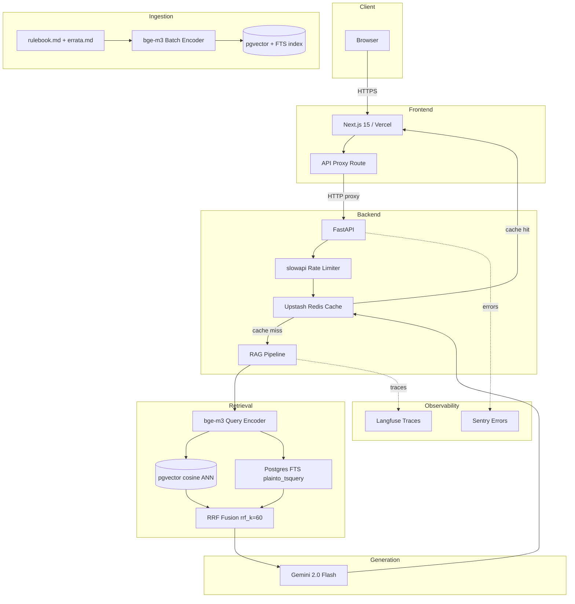

# Architecture

This document is a standalone reference for the Riftbound Judge AI system architecture. The same diagram is embedded in the root README.

---

## System Diagram

---

## Request Path (online)

1. The browser sends a question to the Next.js frontend.
2. Next.js proxies the request to the FastAPI backend via an API route (`/api/query`).
3. FastAPI validates the request with Pydantic and passes it through the `slowapi` rate limiter (10 req/min, 100 req/day per IP by default).
4. The pipeline checks the Upstash Redis cache. On a hit, the cached response is returned immediately.
5. On a cache miss, the query is encoded with `BAAI/bge-m3` (local inference, 1024-dimensional output).
6. Two parallel retrieval queries run against Postgres (Supabase):
   - Dense ANN query using the pgvector `<=>` cosine distance operator, fetching `top_k_fetch=15` results.
   - Full-text search using `plainto_tsquery('simple', query)`, fetching `top_k_fetch=15` results.
7. The two result lists are fused with Reciprocal Rank Fusion (`rrf_k=60`), producing a ranked list of `top_k=5` chunks.
8. A grounding prompt is constructed containing the question and the 5 retrieved chunks, then sent to Gemini 2.0 Flash.
9. The answer is post-validated (citation IDs checked against retrieved chunk IDs), stored in Redis, and returned.
10. Langfuse traces the retrieval and generation steps. Sentry captures any unhandled exceptions.

## Ingestion Path (offline)

1. `rulebook.md` and `errata.md` are chunked by section using the ingestion script under `backend/scripts/`.
2. Each chunk is encoded with `bge-m3` (same model as query time — no embedding gap).
3. Chunks and their embeddings are upserted into the `corpus_chunks` table in Supabase.
4. Postgres `to_tsvector('simple', content)` is computed at insert time and available for FTS queries immediately.

## Key Configuration Parameters

| Parameter | Default | Effect |
|---|---|---|
| `top_k` | 5 | Number of chunks returned to the LLM |
| `top_k_fetch` | 15 | Number of candidates fetched from each retrieval signal before RRF fusion |
| `rrf_k` | 60 | RRF smoothing constant — lower values amplify top-ranked results |
| `gemini_model` | `gemini-2.0-flash` | LLM used for generation |
| `enable_reranker` | `false` | Cross-encoder reranker — not implemented in v1 |
| `cache_ttl_s` | 86400 | Redis TTL per cached answer (24 hours) |
