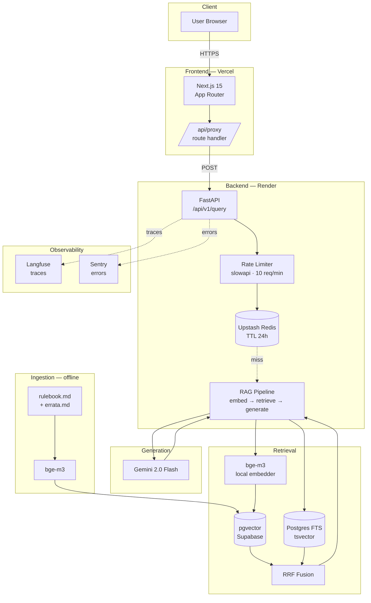

# Portfolio Polish — Technical Design

> Architectural design for the `portfolio-polish` change. No code is modified. This document defines the **information architecture** of the portfolio artifacts: file layout, README structure, diagram contents, results-table policy, ADR outlines, blog outline, and FUTURE_WORK structure.

## 1. Approach Summary

A recruiter spends ~90 seconds on a repo. The README is a funnel: hero → claim → proof → method → action. Every section earns its place by answering one of *what / how / why / does the author know*. Everything else (ADRs, blog, FUTURE_WORK) is **linked from**, not duplicated in, the README. ADRs are the single source of truth for decisions; the README references them by ID. Results numbers are sourced from `backend/data/eval_runs/`; if absent, the cell is `TBD` — never fabricated.

**Honesty constraint.** The codebase has measured state that the proposal and spec must respect:

- Hybrid retrieval (dense + Postgres FTS + RRF) IS implemented (`backend/app/rag/retrieval.py`).
- Cross-encoder reranker is NOT implemented (only a `enable_reranker: bool = False` flag stub).
- Entity resolution is PARTIAL: `card_mentions` threads through `pipeline.answer_question` and the cache key, but no card-text injection in `build_prompt` and no `@mentions` UI exist.
- `backend/data/eval_runs/` is empty except for `.gitkeep` — no RAGAS runs exist yet at design time.
- The runtime stack is **raw psycopg2 + Pydantic + bge-m3**, NOT LlamaIndex. The earlier roadmap mentioned LlamaIndex; the actual implementation diverged. ADR text must reflect the real stack, not the planning aspiration.

## 2. File Structure

```
README.md                            ← root, hub
LICENSE                              ← MIT, year 2026, Gonzalo Asencio
FUTURE_WORK.md                       ← root, deferred backlog
docs/
├── adrs/
│   ├── README.md                    ← index of ADRs (1 paragraph each)
│   ├── ADR-001-embeddings.md        ← bge-m3 vs OpenAI
│   ├── ADR-002-vector-db.md         ← pgvector vs dedicated
│   ├── ADR-003-hybrid-retrieval.md  ← dense + FTS + RRF
│   ├── ADR-004-entity-resolution.md ← decision pending eval data
│   └── ADR-005-llm-choice.md        ← Gemini 2.0 Flash
├── architecture.md                  ← standalone Mermaid diagram + narrative
├── blog/
│   └── post.md                      ← 1500–2500w technical post
├── demo-queries.md                  ← 5 prepared queries with expected behavior
├── video-script.md                  ← 3-min shot list (out of scope to record)
└── launch-posts.md                  ← LinkedIn + X copy
```

**Rationale**
- `docs/adrs/README.md` exists so the directory is browsable on GitHub at a glance (the user sees titles, not just filenames).
- `docs/architecture.md` duplicates the README diagram in a standalone page so the README block can be linked-to (`#architecture`) AND the diagram has a permalink for sharing.
- `FUTURE_WORK.md` lives at root (not under `docs/`) because GitHub renders root markdown files as a project signal; recruiters notice them.
- No `CHANGELOG.md` — out of scope and unmaintained changelogs hurt more than they help.

## 3. README Section Order

The recruiter reads top-to-bottom. Each section must earn its place. Final order:

| # | Section | Why this position | Word budget |
|---|---|---|---|
| 1 | Title + one-liner | First glance. What is this? | ~30w |
| 2 | Badges | Build/license credibility. Below title to not delay the hook. | n/a |
| 3 | Hero asset + 3 links (Live Demo · Blog · Video) | Visual proof + clear paths to deeper artifacts | n/a |
| 4 | What it does (2 paragraphs) | Problem + solution narrative. THE 30-second pitch. | ~150w |
| 5 | Architecture (Mermaid) | Answers "how". Diagram before tech list so the reader sees the *shape* first. | n/a |
| 6 | Tech Stack table | Names the choices the diagram showed. tech → reason. | n/a |
| 7 | Results table + methodology footnote | The proof. Numbers + how they were measured. TBD allowed. | n/a |
| 8 | Key Decisions (ADR links) | Bridges results to reasoning. Links out, doesn't expand inline. | ~100w |
| 9 | Setup (Prerequisites → Backend → Frontend → Eval) | Operational. Below the narrative because most recruiters skip it. | n/a |
| 10 | Evaluation Methodology | One paragraph + bullets. Eval set size, RAGAS, run conditions. | ~120w |
| 11 | What's Next | Single link to `FUTURE_WORK.md`. Honest about limits. | ~30w |
| 12 | Credits | Data sources (Riftcodex, official Riftbound rulebook), libs, license line. | ~50w |

**Order is deliberate**: diagram before stack table, results before ADRs, ADRs before setup. The funnel is *what → how → did it work → why these choices → can I run it*.

## 4. Mermaid Diagram

The diagram must show three flows in one image: **query path**, **ingestion path**, **observability**. Constraint: must render on github.com without errors and stay legible at default zoom.



**Design notes**
- Subgraphs group by deployment surface (Client / Frontend / Backend / Retrieval / Generation / Ingestion / Observability) — recruiters scan vertically.
- The cache miss arrow is dotted to show it's conditional.
- Ingestion is in its own subgraph because it's an offline path; mixing it with the live path confuses readers.
- Observability uses dotted arrows so the primary request path stays visually dominant.
- `bge-m3` appears in two subgraphs (query + ingestion) — that's intentional and accurate. Same model, two contexts.
- Avoid emoji in node labels (some Mermaid renderers on GitHub drop them).

## 5. Results Table Policy

**Decision: only 2 rows have real numbers, the rest are TBD.**

Reality check against the code:
- Config A (vector-only): NOT yet measured. The pipeline currently runs hybrid; running vector-only requires a flag or a separate script. No eval runs exist on disk.
- Config B (hybrid + RRF): NOT yet measured either (no RAGAS runs in `backend/data/eval_runs/`).
- Config C (hybrid + reranker): NOT implemented. The `enable_reranker` flag exists as a stub but no reranker code path is wired.
- Config D (+ entity resolution): PARTIAL. `card_mentions` threads to the pipeline but no card-text injection — equivalent to Config B in measured behavior.

**Table that goes into the README:**

| Configuration | Faithfulness | Ans. Relevancy | Ctx. Precision | Ctx. Recall | p95 Latency | Cost/query |
|---|---|---|---|---|---|---|
| A — Vector only (baseline) | TBD | TBD | TBD | TBD | TBD | TBD |
| B — Hybrid (dense + FTS + RRF) | TBD | TBD | TBD | TBD | TBD | TBD |
| C — Hybrid + Reranker | not implemented | — | — | — | — | — |
| D — + Entity Resolution | not implemented | — | — | — | — | — |

**Methodology footnote (verbatim under the table):**

> Eval set: TBD questions across 5 categories (easy, multi-step, card-specific, edge case, adversarial). Framework: RAGAS (faithfulness, answer_relevancy, context_precision, context_recall). Latency measured server-side from request to response. Cost computed from Gemini 2.0 Flash token pricing. Runs: 3 per configuration, mean reported. Hardware: TBD. Eval runs land in `backend/data/eval_runs/` — `TBD` rows will be filled in once those runs exist.

**Rule for the apply phase**: the writer fills TBD cells only if a corresponding JSON exists in `backend/data/eval_runs/`. No exceptions. If the reviewer wants numbers, they go run the eval — this is a documentation change, not a measurement change.

## 6. ADR Outlines

All ADRs share a template:

```
# ADR-NNN: <Title>

- Status: Accepted | Superseded | Proposed
- Date: 2026-05-15
- Authors: Gonzalo Asencio

## Context
<1–2 paragraphs: the problem and the forces in play>

## Decision
<1–2 sentences: the chosen option, stated declaratively>

## Alternatives Considered
- <Option> — rejected because <reason>

## Consequences
- ✅ <positive>
- ✅ <positive>
- ❌ <negative or accepted tradeoff>
```

### ADR-001: bge-m3 over OpenAI text-embedding-3-small

- **Context.** RAG needs an embedding model with multilingual support (rulebook + Spanish queries) and stable cost at portfolio scale. Two candidates: OpenAI `text-embedding-3-small` (paid, hosted) vs `BAAI/bge-m3` (open weights, runs locally).
- **Decision.** Use `BAAI/bge-m3` loaded via `sentence-transformers` in-process.
- **Alternatives considered.** OpenAI text-embedding-3-small — rejected (recurring cost, network dependency, lock-in). Cohere embed-multilingual-v3 — rejected (paid).
- **Consequences.**
  - ✅ Zero embedding cost at portfolio scale.
  - ✅ Multilingual out of the box (M3 covers 100+ languages).
  - ❌ Cold start: model load adds ~3–5s to first request and ~1.2 GB of RAM. Mitigated by warming on startup.
  - ❌ Reproducibility tied to a specific HF revision — pinned in requirements.

### ADR-002: pgvector on Supabase over a dedicated vector DB

- **Context.** The system already needs a relational store for chunks, metadata, and (eventually) feedback. Adding a dedicated vector DB (Pinecone, Qdrant, Weaviate) means two systems to operate, two sets of credentials, two failure modes.
- **Decision.** Use `pgvector` on Supabase as the single store for chunks, embeddings, and FTS indexes.
- **Alternatives considered.** Pinecone — rejected (paid past free tier, no FTS in same store). Qdrant Cloud — rejected (extra service, no relational join). Local FAISS — rejected (no persistence story, no FTS).
- **Consequences.**
  - ✅ One DB, one connection pool, one backup story.
  - ✅ Hybrid retrieval (vector + FTS) joins on the same table — no cross-system fan-out.
  - ❌ pgvector index build is slower than Pinecone for very large corpora — irrelevant at portfolio scale (~hundreds of chunks).
  - ❌ Latency floor is Postgres-bound, not vector-DB-tuned — acceptable for the SLO.

### ADR-003: Hybrid retrieval (dense + FTS) with Reciprocal Rank Fusion

- **Context.** Pure dense retrieval misses queries with rare keywords (card names, errata phrasings). Pure keyword search misses semantic paraphrase. The eval set will contain both kinds.
- **Decision.** Run vector search and Postgres `to_tsvector` FTS in parallel, fuse with Reciprocal Rank Fusion (`rrf_k=60`, `top_k_fetch=15`, final `top_k=5`).
- **Alternatives considered.** Vector-only — rejected (fails on rare-term queries, see Specs/06). BM25-only — rejected (fails on paraphrase). Weighted score fusion — rejected (requires score normalization across incompatible scales; RRF sidesteps this entirely).
- **Consequences.**
  - ✅ Robust across phrasing variations and rare-keyword queries.
  - ✅ RRF is parameter-light — `rrf_k` is the only knob and it's stable at 60.
  - ❌ Two queries per request — latency overhead vs single-path retrieval. Measured impact lands in the results table once runs exist.
  - ❌ Tie-break logic (vector wins) is documented but easy to misread; covered by tests.

### ADR-004: Entity resolution deferred pending failure analysis

- **Context.** Card-specific queries ("¿Puede Ahri bloquear?") can fail if the card text only appears in a dedicated cards table, not in the rulebook chunks. The fix — inject the mentioned card's text into the prompt — costs UI work (an `@mentions` picker) and prompt tokens.
- **Decision.** Defer full implementation. Keep the `card_mentions` parameter threaded through the pipeline as a forward-compatible hook; do NOT build the UI or inject card text until the eval shows card-specific queries fail at >20% rate.
- **Alternatives considered.** Build it now (Mode A `@mentions`) — rejected (no data showing the failure mode is real). Auto-detect card names via fuzzy match (Mode B) — rejected (high false-positive rate, see Specs/07).
- **Consequences.**
  - ✅ Avoids premature complexity in the UI and prompt budget.
  - ✅ The decision is reversible — the threading is already in place.
  - ❌ Card-specific queries currently rely on chunk retrieval alone. Acceptable until measured otherwise.
  - ❌ The README cannot show a Config D row with real numbers until this is built.

### ADR-005: Gemini 2.0 Flash for generation

- **Context.** Generation needs to be cheap (portfolio cost budget = $0), fast (sub-3s p95 user-facing), and good enough at instruction-following to follow a citation-grounded prompt without hallucinating.
- **Decision.** Use Gemini 2.0 Flash via the official Google AI Studio API.
- **Alternatives considered.** GPT-4o-mini — rejected (paid from request one, no free tier comparable to Gemini's 1M tok/day). Claude Haiku — rejected (same cost concern). Self-hosted Llama 3.1 8B — rejected (operational overhead, no free GPU tier viable for portfolio).
- **Consequences.**
  - ✅ Free tier covers portfolio traffic completely.
  - ✅ Low latency — Flash is optimized for short-context, fast generation.
  - ❌ Vendor lock-in to Google AI surface. Mitigated by isolating the call in `app/rag/generation.py` (`call_gemini`).
  - ❌ Free-tier rate caps require backoff handling — implemented in production-hardening change.

## 7. Blog Post Outline (`docs/blog/post.md`, 1500–2500 words)

The post is structured as a narrative of decisions, not a tutorial. Recruiters reading the blog want to see *thinking*, not *steps*.

### Section-by-section

1. **Hook** (~120w) — Open with a concrete query and a wrong answer the baseline gave (real or constructed honestly). Land the line: "the model wasn't lying — the retriever was."
2. **The Problem** (~150w) — Why RAG for a TCG rulebook. Why not pure LLM (knowledge cutoff, hallucinated card names). Why not pure search (multi-step rules questions). Frame the project as a retrieval-engineering exercise.
3. **The Approach** (~180w) — Eval-set-first. The decision to spend Week 1 on questions, not code. The four questions a recruiter must answer in 90s (mirrors the README funnel).
4. **Building the Eval Set First** (~220w) — Curated TBD-N questions across 5 categories. Why N curated > 200 mediocre. How a domain-expert player reviewed them. Reference Specs/03.
5. **Baseline: Simple RAG** (~200w) — Dense retrieval only, top-k=5. Initial numbers (TBD; flag explicitly as "to be filled in"). Surprises: what kind of questions broke first. Reference Specs/05.
6. **The Ablation Study** (~280w) — Table (mirroring the README table). What each configuration changed and why. Honest note: only B is currently measurable; C and D are intentionally deferred. Reference ADR-003 and ADR-004.
7. **The Entity Resolution Decision** (~220w) — Why this was the most interesting decision. The 20% failure-rate threshold from Specs/07. How the threading was wired forward so the decision stays reversible. Why "deferred with hook in place" is sometimes the right answer. Reference ADR-004.
8. **What Surprised Me** (~180w) — Two or three real findings (placeholder during draft, filled with concrete observations from the build). Format: "Expected X. Got Y. What I learned." Examples to draw from: cache hit-rate vs prediction; FTS catching errata that dense missed; bge-m3 cold-start cost; Gemini's behavior on prompt-injection queries.
9. **What I'd Do Differently** (~150w) — Three honest limitations. Format: "If I started today, I would…". Candidates: write the eval set in a structured schema from day one; commit `eval_runs/` outputs earlier; track per-category metrics from the first run.
10. **Tech Stack** (~80w) — Compact list with links. Mirror the README table.
11. **Try It / See the Code** (~50w) — Three links (Live Demo, GitHub, this blog post canonical).

**Tone constraints** (carried from spec): technical, honest, no marketing. Use first-person singular. Avoid emoji in body text. Code blocks are pseudo-code only when illustrative — full files go in the repo, not the post.

## 8. FUTURE_WORK.md Structure

Categorized by horizon. Each entry has a one-line motivation and (where relevant) a pointer to the ADR or spec it derives from.

```markdown
# Future Work

This file tracks deferred work. Each item is intentionally not in the current
release; the rationale for deferral is captured next to the item.

## Short-term (1–2 weeks)

- **Run the full ablation study and publish numbers.** Replace all `TBD`
  cells in the README results table. See `Specs/06_retrieval_ablation_spec.md`.
- **Streaming responses.** Move the `/api/v1/query` endpoint to Server-Sent
  Events so the frontend shows tokens as they arrive. Vercel AI SDK is
  already a dependency.
- **Per-category failure analysis script.** Auto-generate the failure
  breakdown that feeds the ADR-004 decision.

## Medium-term (1 month)

- **Entity resolution Mode A (`@mentions`).** Build the UI picker and
  inject card text into the prompt. Trigger: card-specific failure rate
  >20%. See ADR-004 and `Specs/07_entity_resolution_spec.md`.
- **Multi-language support (Spanish UI + queries).** bge-m3 already
  supports Spanish; UI and prompt need a language toggle.
- **Feedback loop (thumbs up/down).** Capture user signal per response,
  store in Supabase, feed into a future fine-tuning dataset.
- **Cross-encoder reranker (Config C).** Add `BAAI/bge-reranker-large` as
  a post-retrieval step. The `enable_reranker` flag is already a stub.

## Long-term (3+ months)

- **Cost optimization at scale.** Move embeddings to a hosted endpoint
  if cold-start becomes a UX issue; investigate model distillation.
- **Cards database.** Ingest the full Riftcodex card list as a separate
  table; enables structured card lookups and auto-detection (Mode B).
- **Multi-rulebook support.** Generalize the corpus loader so the same
  pipeline can serve other TCGs.
- **Self-hosted LLM fallback.** Reduce vendor dependency on Gemini; ADR-005
  flags this as the main risk.
```

**Rule**: every item in this file MUST be something the codebase or proposal already implies. No speculative features (e.g., "mobile app", "Discord bot") — those dilute the file and confuse recruiters about scope.

## 9. Cross-Cutting Constraints

- **No code changes.** The spec already forbids edits under `backend/app/`, `backend/scripts/`, or `frontend/src/`. The design preserves this: every artifact above is `.md`, `LICENSE`, or a Mermaid block. If the writer finds a bug while drafting, it becomes a FUTURE_WORK entry, never a commit.
- **Link integrity.** Every ADR linked from the README must exist; every section anchor used in cross-references must resolve. The tasks phase should include a final pass for this.
- **TBD is honest.** Spec requirement "Missing eval data" mandates `TBD` over invented numbers. The design enforces this in the results table and the blog post's metric mentions.
- **One PR.** The proposal frames this as a documentation packaging sprint. Everything ships together so the launch surface is internally consistent (README ↔ ADRs ↔ blog all agree on which configs were measured).

## 10. Risks & Open Questions

| Risk | Mitigation |
|---|---|
| Eval numbers stay TBD at merge time | Acceptable — README states the policy in the methodology footnote. FUTURE_WORK short-term item tracks the follow-up. |
| Mermaid renders differently on GitHub vs IDE | Mitigated by keeping nodes simple (no emoji, no nested HTML), and a `docs/architecture.md` permalink. Tasks phase should preview on GitHub before merge. |
| ADRs drift from code over time | Single source of truth (ADRs); README links by ID, never restates decisions. Verification phase can grep for orphaned ADR references. |
| Hero asset (screenshot/GIF) not yet captured | Use placeholder asset path with a TODO comment. FUTURE_WORK lists "capture hero asset" as short-term. Does not block PR. |
| Live demo URL not provisioned | Placeholder link with a note in README. Same rule as hero asset. |

## 11. Out of Scope (re-affirmed from proposal)

- Recording the video or publishing the blog.
- Setting up Vercel/Render deployments.
- Re-running the eval to fill TBDs.
- Any change under `backend/app/`, `backend/scripts/`, `frontend/src/`.
